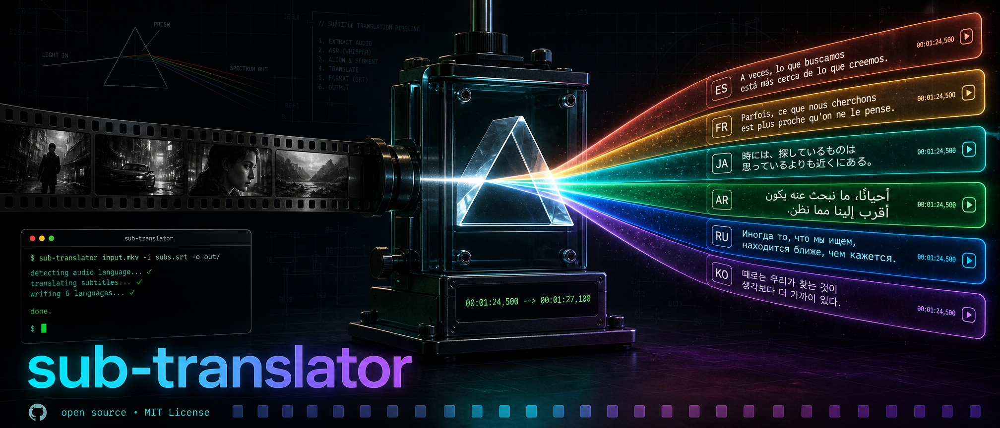

<div align="center">



<br/>
<br/>

[](https://golang.org)
[](LICENSE)
[](https://github.com/artschekoff/sub-translator/releases)

**One command turns a movie you can't understand into a movie you can.**

Extracts the subtitle track from a video file, translates it, and muxes the new track back in — no API keys, no accounts, no re-encoding.

[The Problem](#the-problem) · [Installation](#installation) · [Usage](#usage) · [Transcription](#transcription) · [Configuration](#configuration) · [How It Works](#how-it-works) · [Development](#development)

</div>

---

## The Problem

You have a video with subtitles in a language you don't read. Getting it into a language you do read is normally a five-tool chore:

| The usual pain | What `sub-translator` does |
|---|---|
| **Manual extraction.** Open MKVToolNix, hunt for the right stream index, demux an `.srt` by hand. | Auto-detects the subtitle track by language code — `eng`, `en`, doesn't matter — and extracts it for you. |
| **Web translators mangle SRT files.** Paste a subtitle file into a translator and it "helpfully" translates the timecodes, breaks block numbering, and returns something no player will load. | Parses the SRT properly. Timing lines are copied **byte-for-byte**; only dialogue text is ever sent for translation. |
| **API keys and billing.** Most translation tooling wants a cloud account, a credit card, and a quota dashboard before it will translate one file. | Zero setup. Uses Google Translate's free public endpoint — no key, no login, no quota to manage. |
| **Slow, one-line-at-a-time translation.** Naive tools fire one request per subtitle block: thousands of round-trips for a feature film. | Batches ~40 blocks per request, with automatic per-block retry so one bad block can't poison the batch. |
| **Re-muxing loses quality.** Re-encoding to add a subtitle track costs an hour of CPU and a generation of video quality. | Stream-copies everything. Video and audio are untouched; only a new subtitle track is added. Takes seconds. |
| **AVI can't hold subtitles.** So the tool errors out and you're left with nothing. | Detects the container limitation and writes an external `.srt` next to the video instead — which is also what the default mode does for every container. |
| **No subtitles at all.** A rip with a single audio track and no subtitle stream leaves subtitle tools with nothing to work on. | Transcribes the audio with whisper.cpp, then translates the transcript — the same one command. |

The result is one command, a few seconds of waiting, and a file that plays with translated subs in any player.

## Features

- **Automatic track detection** — finds the right subtitle track by language code, no manual stream index needed
- **Sidecar or embedded** — writes a `.srt` next to your video by default, or embeds the translated track into a new container with `-mode mux`
- **Timing-safe translation** — timecode lines are never sent to the translator, so sync is preserved exactly
- **Smart batching** — groups subtitle blocks for fewer requests, with per-block fallback on failure
- **ISO 639-1/2 aware** — handles both `en` and `eng`, `es` and `spa` transparently
- **Multi-format muxing** — embeds the translated track into MKV/MP4; saves external SRT for AVI
- **Zero API keys** — no account, no credentials, no rate-limit dashboard
- **Lossless** — stream copy only; your video and audio bits are never re-encoded
- **Progress output** — live `%` counter so you know it's working
- **Audio transcription** — no subtitle track? whisper.cpp transcribes the audio and the transcript is translated like any other subtitle file
- **Shared model store** — reuses `ggml-*.bin` models other whisper.cpp front-ends already downloaded, so a 1.6 GB model is never fetched twice
- **Remembered settings** — binary and model paths are configured once with `sub-translator config set`

## Supported Formats

| Container | `-mode srt` (default) | `-mode mux` | `-mode both` |
|-----------|:---------------------:|:-----------:|:------------:|
| MKV       | ✅ sidecar `.srt`     | ✅ embedded | ✅ |
| MP4 / M4V / MOV | ✅ sidecar `.srt` | ✅ embedded (`mov_text`) | ✅ |
| AVI       | ✅ sidecar `.srt`     | falls back to sidecar | falls back to sidecar |

AVI cannot carry subtitle tracks, so `-mode mux` and `-mode both` downgrade to a sidecar `.srt` and say so.

## Installation

**Prerequisite:** [ffmpeg](https://ffmpeg.org/download.html) must be in `$PATH` — it does the probing, extraction and muxing.

```bash
# macOS
brew install ffmpeg

# Ubuntu / Debian
sudo apt install ffmpeg
```

### From a release

Grab the archive for your platform from [Releases](https://github.com/artschekoff/sub-translator/releases), unpack it, and put the binary on your `$PATH`:

```bash
tar -xzf sub-translator-darwin-arm64.tar.gz
sudo mv sub-translator-darwin-arm64 /usr/local/bin/sub-translator
```

### From source

Needs [Go 1.26+](https://golang.org/dl/).

```bash
git clone https://github.com/artschekoff/sub-translator
cd sub-translator

make build      # -> ./bin/sub-translator
make install    # -> /usr/local/bin/sub-translator (uses sudo)
```

## Usage

```
sub-translator [flags] <input>
```

```
Flags:
  -from          source language code (prompted for if omitted; detected in audio mode)
  -to            target language code (required; prompted for if omitted)
  -source        subtitle source: sub, audio or auto (default: auto)
  -track         subtitle stream index, -1 = auto-detect by -from lang (default: -1)
  -atrack        audio stream index, -1 = auto (default: -1)
  -mode          output mode: srt, mux or both (default: srt)
  -out           output path (.srt in srt mode, container otherwise)
  -fast          write subtitles progressively so the opening is watchable within a minute
  -chunk         chunk length in minutes for -fast (default: 10)
  -whisper-model path to a whisper ggml model
  -whisper-bin   path to the whisper-cli binary
  -vad-model     path to a Silero VAD model
  -version       print version and exit
```

### Output modes

| Mode | What you get | When to use it |
|------|--------------|----------------|
| `srt` *(default)* | `movie.es.srt` next to the video | Fastest, non-destructive — your video file is never rewritten and no second copy lands on disk. Works with any player that loads sidecar subtitles. |
| `mux` | `movie.ES.mkv` with the translated track embedded | One self-contained file to copy to a TV, phone or media server that ignores sidecars. Costs a full copy of the video on disk. |
| `both` | `movie.ES.mkv` **and** `movie.es.srt` | You want the embedded track but also a plain-text copy to edit or reuse. |

### Examples

```bash
# Default: write movie.es.srt next to the video
sub-translator -from en -to es movie.mkv

# Omit the languages and you'll be asked for both
sub-translator movie.mkv

# Embed the translated track into a new container
sub-translator -from en -to fr -mode mux movie.mkv

# Embedded track plus a sidecar .srt
sub-translator -from en -to de -mode both movie.mp4

# Pick a specific subtitle track by stream index
sub-translator -from en -to ru -track 3 movie.mkv

# Custom output path (names the .srt in srt mode)
sub-translator -from en -to es -out /tmp/movie_es.srt movie.mkv

# Custom output path (names the container in mux mode)
sub-translator -from en -to es -mode mux -out /tmp/movie_es.mkv movie.mkv
```

### Track listing and prompts

Every run lists the subtitle tracks it found before doing anything else:

```
$ sub-translator movie.mkv
Probing movie.mkv...
Subtitle tracks:
  #2   lang=rus      Rus, SRT
  #3   lang=eng      Eng, SRT
Source language code (e.g. en, ru, es, fr): ru
Target language code (e.g. en, ru, es, fr): en
```

Neither `-from` nor `-to` has a default — guessing the languages silently is worse than asking — so an omitted flag prompts on stderr. When stdin isn't interactive (a pipe, CI), the run errors out instead of hanging.

The listing matters because plenty of releases ship subtitle tracks with **no language tag at all**:

```
Subtitle tracks:
  #2   lang=(none)   (none)
```

Auto-detection by `-from` can't match those, so pick the track by its stream index:

```bash
sub-translator -from ru -to en -track 2 movie.mkv
```

`-track` takes the **absolute** ffprobe stream index shown in the listing, not the position among subtitle tracks. With `-track` set, `-from` no longer selects the track — it only tells the translator what language the text is in. If the file has no subtitle streams at all, `-source sub` exits with `nothing to translate`; the default `-source auto` instead offers to transcribe the audio — see [Transcription](#transcription).

### Output naming

| Input | Flags | Output |
|-------|-------|--------|
| `movie.mkv` | *(default)* | `movie.es.srt` |
| `movie.mkv` | `-mode mux` | `movie.ES.mkv` |
| `movie.mkv` | `-mode both` | `movie.ES.mkv` + `movie.es.srt` |
| `movie.mp4` | `-to fr -mode mux` | `movie.FR.mp4` |
| `movie.avi` | `-mode mux` | `movie.es.srt` *(downgraded)* |

## Transcription

When a video has no subtitle track, `sub-translator` can generate one from the audio using [whisper.cpp](https://github.com/ggml-org/whisper.cpp).

**Prerequisites:**

```bash
brew install whisper.cpp              # provides the whisper-cli binary
sub-translator model pull large-v3-turbo
```

`model pull` downloads to `~/Library/Application Support/sub-translator/models` (macOS) or `~/.local/share/sub-translator/models` (Linux). If another whisper.cpp front-end has already downloaded a model, it is found and reused — the files use the same `ggml-<name>.bin` format and these locations are searched:

1. `models.dir` from the config, when set
2. `sub-translator`'s own install directory (the platform default above)
3. `~/Library/Application Support/net.slaive.app/models` (macOS)
4. `~/.cache/whisper.cpp`
5. `./models`

**Usage:**

```bash
# auto: uses the subtitle track if there is one, otherwise offers to transcribe
sub-translator -to es movie.mkv

# force transcription even when subtitle tracks exist
sub-translator -to es -source audio movie.mkv

# pick a specific audio track and skip language detection
sub-translator -to es -source audio -atrack 1 -from en movie.mkv
```

The source language is detected automatically, so `-from` is optional here. Passing it is faster and more reliable when you already know it.

The untranslated transcript is saved next to the video as `<video>.<lang>.srt`, so you can read it, fix a mis-heard name in it, or feed it somewhere else by hand — transcription is the expensive step and its output is worth keeping.

### Watching before it finishes

Transcription runs far faster than playback — about 14× real time on an M1 Pro — but the normal mode still writes nothing until the last block is done. `-fast` changes that: it transcribes and translates the film in ten-minute chunks and rewrites the subtitle file after each one, so the opening is watchable within a minute.

```bash
sub-translator -to es -source audio -fast movie.mkv
```

```
Saved SRT: movie.es.srt — covers 0:00–0:10:00, you can start watching
  extended to 0:20:00
  extended to 0:30:00
Done: movie.es.srt covers the full 2:19:08 — reload subtitles in your player
```

Your lead grows as you watch: by the time you reach minute ten of the film, the file already covers minute one hundred and twenty.

**Reload the subtitles once at the end.** Players read a `.srt` when they load it and do not notice the file growing, so the track you started with covers only the first chunk. Re-selecting the subtitle track picks up the finished file. On macOS a desktop notification fires when it is complete.

Chunk length is `-chunk N` minutes, or `whisper.chunk-minutes` in the config; both default to 10. A line spoken across a chunk boundary is split into two, which is the cost of not waiting.

`-fast` requires `-source audio` (there is nothing to wait for when a subtitle track already exists) and the default `-mode srt` (a video container cannot be rewritten piece by piece).

**Voice activity detection** is off by default. It skips silence and can prevent whisper's decoder from looping on long quiet stretches, but measured against the same model it merges speech into longer, less punctuated subtitle blocks — so it is worth turning on only if you actually hit the looping problem, not as a general-purpose default. The symptom is unmistakable: the progress counter stalls, the run takes far longer than the audio it is transcribing, and the same line repeats over and over in the output. Enable it by pointing at a model explicitly, either for one run or persistently:

```bash
sub-translator model pull silero-vad

sub-translator -to es -source audio -vad-model ~/models/ggml-silero-v5.1.2.bin movie.mkv
# or persistently:
sub-translator config set whisper.vad-model ~/models/ggml-silero-v5.1.2.bin
```

## Configuration

Settings live in `~/.config/sub-translator/config.json` and are managed from the command line:

```bash
sub-translator config list
sub-translator config set whisper.model ~/models/ggml-large-v3-turbo.bin
sub-translator config set whisper.bin /opt/homebrew/bin/whisper-cli
sub-translator config get whisper.model
sub-translator config path
```

| Key | Meaning |
|---|---|
| `whisper.bin` | Path to `whisper-cli`. Found on `$PATH` when unset. |
| `whisper.model` | Path to a ggml transcription model. Discovered when unset. |
| `whisper.vad-model` | Path to a Silero VAD model. Off unless set here or with `-vad-model`. |
| `whisper.vad-threshold` | Speech detection threshold, 0–1. whisper's default when unset. |
| `whisper.threads` | Threads for transcription. whisper chooses when unset. |
| `whisper.language` | Default source language. `auto` when unset. |
| `whisper.chunk-minutes` | Chunk length for `-fast`, in minutes. 10 when unset. |
| `models.dir` | Where `model pull` writes, and the first directory searched. |

The corresponding flags — `-whisper-model`, `-whisper-bin`, `-vad-model`, `-chunk` — override the config for a single run.

## Languages

Use standard [ISO 639-1](https://en.wikipedia.org/wiki/List_of_ISO_639-1_codes) two-letter codes. Both `en`/`eng` forms are accepted as input.

| Code | Language   | Code | Language   | Code | Language  |
|------|------------|------|------------|------|-----------|
| `es` | Spanish    | `fr` | French     | `de` | German    |
| `it` | Italian    | `pt` | Portuguese | `ru` | Russian   |
| `zh` | Chinese    | `ja` | Japanese   | `ko` | Korean    |
| `ar` | Arabic     | `pl` | Polish     | `nl` | Dutch     |
| `tr` | Turkish    | `uk` | Ukrainian  | `sv` | Swedish   |

Any language code supported by Google Translate works — the table above is just a reference.

## How It Works

```
input.mkv
    │
    ├─ ffprobe   →  detect subtitle tracks
    ├─ ffmpeg    →  extract .srt (stream copy, no decode)
    ├─ parse     →  split into blocks, preserve timing lines exactly
    ├─ translate →  batch requests to Google Translate (40 blocks/req)
    ├─ rebuild   →  merge translated text back, timing untouched
    └─ ffmpeg    →  mux new track into output container (stream copy)
```

Timing lines (`00:00:00,000 --> 00:00:00,000`) are copied verbatim — translation never touches them. Every ffmpeg call is a stream copy, so the pipeline is I/O-bound, not CPU-bound: a two-hour film is done in seconds plus translation time.

## Project Layout

```
main.go               flag parsing + pipeline orchestration
source.go             subtitle source (sub / audio / auto) parsing and resolution
mode.go               output mode (srt / mux / both) parsing and container fallback
ui.go                 track listing, language and confirmation prompts
cmd_config.go         `config list|get|set|path` subcommand
cmd_model.go          `model list|pull` subcommand
internal/media/       ffprobe / ffmpeg wrappers: probe, extract, mux, path naming
internal/srt/         SRT parse, rebuild, write
internal/translate/   batched Google Translate client
internal/whisper/     whisper.cpp CLI wrapper: binary lookup, flags, progress
internal/config/      ~/.config/sub-translator/config.json read, write, get, set
internal/models/      ggml model catalog, search directories, discovery, download
```

## Development

| Target | What it does |
|--------|--------------|
| `make build`     | Build `./bin/sub-translator` with the version stamped in |
| `make build-all` | Cross-compile darwin/linux (amd64 + arm64) and windows/amd64 |
| `make pack`      | `build-all`, then archive each binary into `./bin/dist` |
| `make install`   | Build and copy to `/usr/local/bin` (uses `sudo`) |
| `make test`      | `go test ./... -v` |
| `make fmt`       | `gofmt -w .` |
| `make vet`       | `go vet ./...` |
| `make tidy`      | `go mod tidy` |
| `make validate`  | `fmt` + `vet` + `test` |
| `make clean`     | Remove `./bin` |
| `make release`   | Interactive version bump → tag → push → pack → GitHub release |

`make release` reads the latest tag, prompts for a `major`/`minor`/`patch` bump (default `patch`), tags and pushes the new version, packs the cross-compiled archives, and publishes them with `gh release create --generate-notes`. It needs the [`gh` CLI](https://cli.github.com/) authenticated against this repo.

## License

MIT — see [LICENSE](LICENSE).
