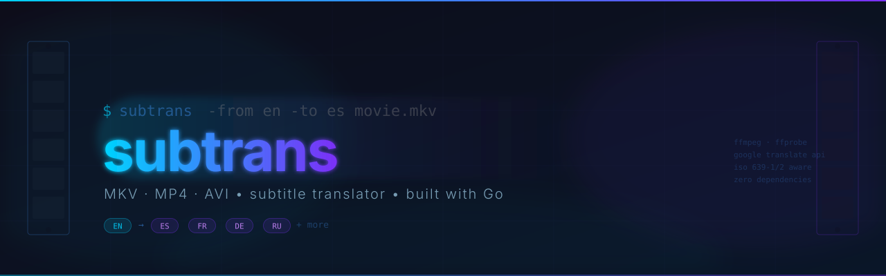

<div align="center">



<br/>

[](https://golang.org)
[](LICENSE)
[](https://github.com/artschekoff/subtrans/releases)

**CLI tool that extracts subtitles from video files, translates them, and muxes the new track back in — zero API keys required.**

[Installation](#installation) · [Usage](#usage) · [Supported formats](#supported-formats) · [Languages](#languages)

</div>

---

## Features

- **Automatic track detection** — finds the right subtitle track by language code, no manual stream index needed
- **Smart batching** — groups subtitle blocks for fewer requests, with per-block fallback on failure
- **ISO 639-1/2 aware** — handles both `en` and `eng`, `es` and `spa` transparently
- **Multi-format muxing** — embeds translated track into MKV/MP4; saves external SRT for AVI
- **Zero API keys** — uses Google Translate's free public endpoint
- **Progress output** — live `%` counter so you know it's working

## Supported Formats

| Container | Embed subtitle track | External SRT |
|-----------|:-------------------:|:------------:|
| MKV       | ✅                  | optional (`-srt`) |
| MP4 / M4V / MOV | ✅            | optional (`-srt`) |
| AVI       | ❌ (not supported by container) | ✅ auto |

## Installation

**Prerequisites:** [Go 1.22+](https://golang.org/dl/) and [ffmpeg](https://ffmpeg.org/download.html) must be in `$PATH`.

```bash
# macOS
brew install ffmpeg go

# Ubuntu / Debian
sudo apt install ffmpeg golang-go
```

```bash
git clone https://github.com/artschekoff/subtrans
cd subtrans
go build -o subtrans .

# Optional: install globally
sudo mv subtrans /usr/local/bin/
```

## Usage

```
subtrans [flags] <input>
```

```
Flags:
  -from   source language code  (default: en)
  -to     target language code  (default: es)
  -track  subtitle stream index, -1 = auto-detect (default: -1)
  -srt    also save translated .srt alongside the output file
  -no-mux skip muxing, only save translated .srt
  -out    custom output file path
```

### Examples

```bash
# Translate English subs to Spanish, embed into new MKV
subtrans movie.mkv

# Translate to French
subtrans -to fr movie.mkv

# Save SRT only, skip muxing
subtrans -no-mux movie.mkv

# Also keep the .srt file alongside the output
subtrans -srt -to de movie.mp4

# Pick a specific subtitle track by stream index
subtrans -track 3 movie.mkv

# Custom output path
subtrans -out /tmp/movie_es.mkv movie.mkv
```

### Output naming

| Input | Flag | Output |
|-------|------|--------|
| `movie.mkv` | *(default)* | `movie.ES.mkv` |
| `movie.mp4` | `-to fr` | `movie.FR.mp4` |
| `movie.mkv` | `-srt` | `movie.ES.mkv` + `movie.es.srt` |
| `movie.avi` | *(any)* | `movie.es.srt` *(AVI only)* |

## Languages

Use standard [ISO 639-1](https://en.wikipedia.org/wiki/List_of_ISO_639-1_codes) two-letter codes. Both `en`/`eng` forms are accepted as input.

| Code | Language   | Code | Language   | Code | Language  |
|------|------------|------|------------|------|-----------|
| `es` | Spanish    | `fr` | French     | `de` | German    |
| `it` | Italian    | `pt` | Portuguese | `ru` | Russian   |
| `zh` | Chinese    | `ja` | Japanese   | `ko` | Korean    |
| `ar` | Arabic     | `pl` | Polish     | `nl` | Dutch     |
| `tr` | Turkish    | `uk` | Ukrainian  | `sv` | Swedish   |

Any language code supported by Google Translate works — the table above is just a reference.

## How It Works

```
input.mkv
    │
    ├─ ffprobe  →  detect subtitle tracks
    ├─ ffmpeg   →  extract .srt (stream copy, no decode)
    ├─ parse    →  split into blocks, preserve timing lines exactly
    ├─ translate → batch requests to Google Translate (40 blocks/req)
    ├─ rebuild  →  merge translated text back, timing untouched
    └─ ffmpeg   →  mux new track into output container (stream copy)
```

Timing lines (`00:00:00,000 --> 00:00:00,000`) are copied verbatim — translation never touches them.

## License

MIT
